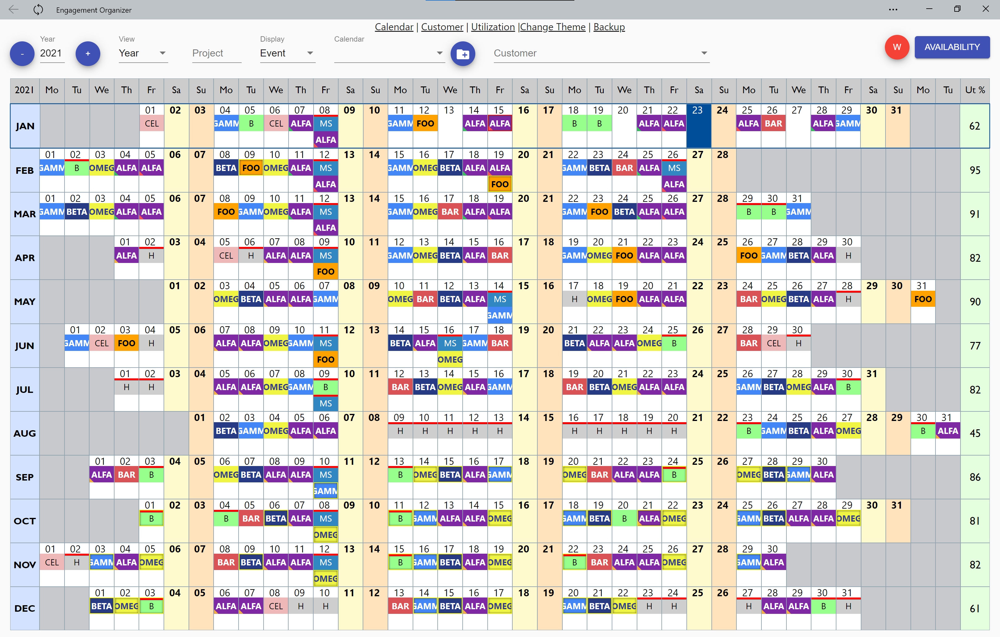
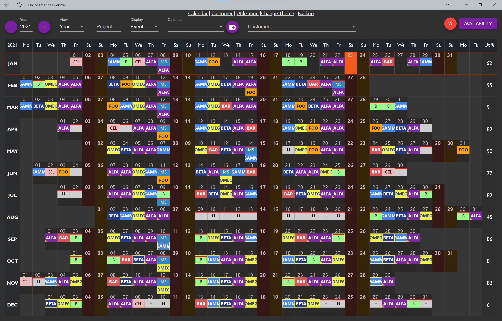
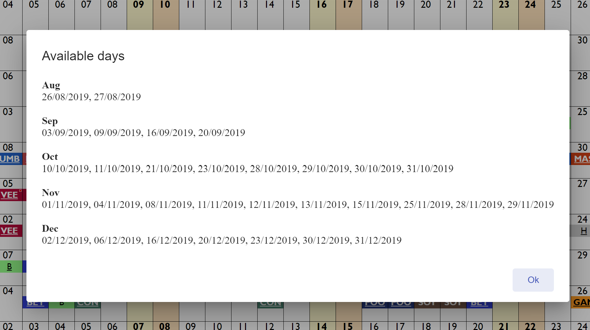
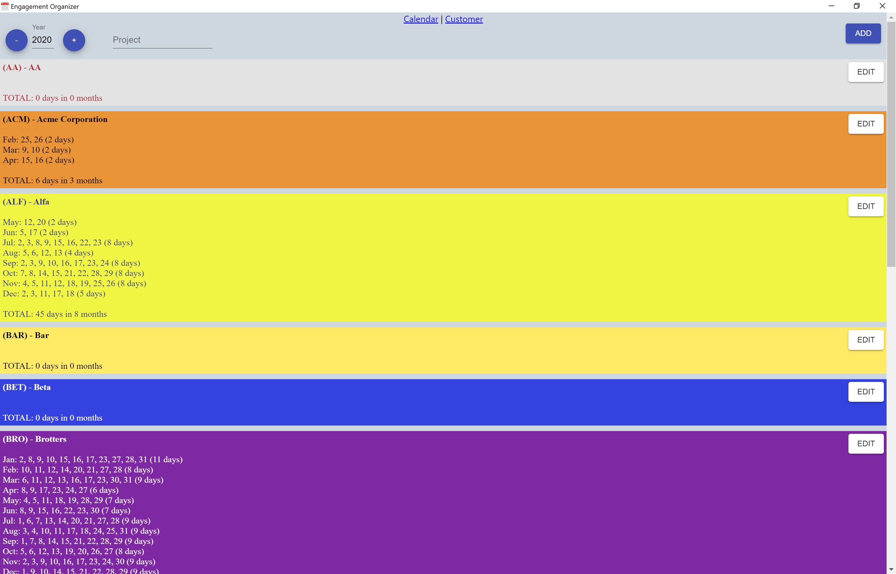

# Engagement-Organizer

Engagement management tool. 

 ## Technologies

- Angular
- Angular Material
- ASP.NET Core
- Entity Framework Core
- SQLite
- Electron

## Introduction

This tool represents a proof of concept. The quality of the code whose completion times were in the order of a few days in my spare time is proof of that (minimum valuable product).

## Build

Requirements: You need to install NodeJS 12.16.1 and .NET Core 3.1 SDK.

Execute the 'src/MakeBuild.ps1' PowerShell script. (PS Core for Linux/Max or execute the .ps1 commands in your favourite console)

Once the build is completed, you can run the self-contained electron application from the './src/dist' folder.

## Areas for improvement

- Unit testing
- CI / CD
- Globalization and i18n
- Bug fix
- Transform hard-coded HTML in Angular Component using tamplates

## Screenshots

**Calendar view**

Light Theme

Dark Theme

**Appointment editing**

**Available days**

**Customer Summary**

## Hosting Models
**Architecture**
The app is composed of 3 layerd:
- API: The REST api that wraps all the business logic and data access (./src/EngagementOrganizer.API)
- SPA: The Single Page Application that represents the user interface (./src/EngagementOrganizer.SPA)
- Electron: Can host the API and SPA for a standalone usage (./src/EngagementOrganizer.App)

**Web Application**
The application can be hosted as a web application, you just need to build and deploy in a web server the following components:
- API
- SPA

**Electron Application**
The GitHub Release or the output of the MakeBuild.ps1 command will produce a standalone Electon Application that can be directly executed 